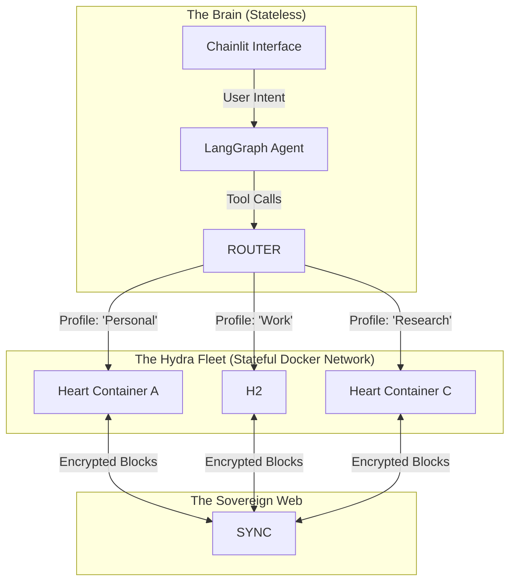

# 🏛️ Architecture Reference: PENNY Knowledge Core

> **System Pattern:** The "Hydra" Fleet (Centralized Brain, Decentralized State)
> **Primary Protocol:** Model Context Protocol (MCP) over HTTP SSE
> **Data Consistency:** Eventual (CRDT-based via Any-Sync)

## 1. High-Level Topology

The system does not follow a traditional 3-tier web architecture. Instead, it operates as a **Federated Agentic Control Plane**. It bridges the stateless world of LLM reasoning with the stateful, encrypted, peer-to-peer world of AnyType.

---

## 2. Component Deep Dive

### 2.1 The "Gateway" (Router)

* **Role:** The single entry point for the Agent. It acts as a reverse proxy and logic translation layer.
* **Technology:** Python 3.12, FastAPI, `mcp` SDK.
* **Key Responsibility:** **Context Routing**.
* The Gateway holds a config map: `{"personal": "http://heart-1:31009", "work": "http://heart-2:31009"}`.
* Every tool call (e.g., `create_object`) accepts an optional `profile_name` argument.
* If `profile_name` is missing, it defaults to the session's active profile (stored in a thread-local context var).

### 2.2 The "Hearts" (Headless Nodes)

* **Role:** The "Hands" that manipulate the data. Each container represents a distinct cryptographic identity (a unique 12-word mnemonic).
* **Technology:** Docker, `anytype-heart` (Go binary), `anytype-jsonapi` wrapper.
* **Persistence:** Each container mounts a local Docker volume `/data`. This contains the `badgerdb` or `sqlite` database storing the decrypted graph.
* **Lifecycle:** These containers must run as **Daemons**. They cannot be spun up on demand because the "Sync Handshake" with the P2P network takes 10-60 seconds on startup. They must be always-on.

### 2.3 The Bridge (MCP Translation)

The core logic resides in how we translate abstract LLM intent into rigid gRPC calls.

| MCP Tool Concept | Underlying Architecture Action |
| --- | --- |
| **`ensure_schema`** | **Diff & Patch.** 1. Fetch all Types via `GET /v1/types`. 2. Compare with requested JSON. 3. Issue `POST` for missing Relations. 4. Issue `POST` for missing Types linking those Relations. |
| **`smart_ingest`** | **RAG & Write.** 1. Chunk input text. 2. Ask LLM to extract JSON matching a known Type. 3. Send JSON to Heart. |
| **`switch_profile`** | **Session State.** Updates the `ContextVar` in the Python Gateway to point to a different container IP. |

---

## 3. Data Flow & Consistency Model

### Write Path (The "Architect" Flow)

1. **Intent:** User says "Add 'Priority' field to 'Tasks'".
2. **Resolution:** Gateway checks if 'Priority' Relation exists in the *Global* dictionary of the target Heart.
3. **Conflict Check:** If 'Priority' exists with ID `123`, it reuses it. If not, it creates a new Relation.
4. **Execution:** Gateway sends `PUT /v1/spaces/{id}/types/{task_id}` to link Relation `123`.
5. **Propagation:** The Heart writes the change to local disk (milliseconds) and queues an encrypted block for the Any-Sync network.
6. **Convergence:** The user's Desktop App receives the block (seconds later) and updates the UI.

### Read Path (The "Concierge" Flow)

1. **Intent:** User says "Find my notes on React".
2. **Search:** Gateway calls `GET /v1/search?query=React`.
3. **Filtering:** The Heart returns raw JSON objects. The Gateway strips huge binary blobs (images/files) to save LLM token context.
4. **Presentation:** The Agent formats the lightweight JSON into a Markdown table for the User.

---

## 4. Network Security & Isolation

This architecture is designed for **Zero-Trust** regarding external providers, but **High-Trust** internally.

* **Ingress:** The `penny-gateway` is the ONLY container exposing a port to the host (usually `8000`).
* **Internal:** The `anytype-heart` containers expose their API ports (`31009`) *only* to the internal Docker network `penny-net`. They cannot be reached directly from the host machine's browser.
* **Egress:** The `anytype-heart` containers require outbound internet access to `tcp/443` and `udp/quic` to talk to Any-Sync nodes.
* **Secrets:** Mnemonics are injected via Docker `environment` variables at runtime. They are never written to disk logs.

## 5. Scaling Strategy

To scale this to an enterprise level (e.g., managing 50 client vaults):

1. **Vertical Scaling:** Increase RAM. Each Heart consumes ~200MB idle, up to 1GB during heavy sync.
2. **Horizontal Scaling:** The Gateway is stateless and can be replicated behind a load balancer. The Hearts are stateful singletons (you cannot run two Hearts for the same account simultaneously without conflict risks).
3. **Orchestration:** Move from Docker Compose to **Kubernetes**. Use a `StatefulSet` for each identity to ensure persistent volume claims (PVC) are stable.
