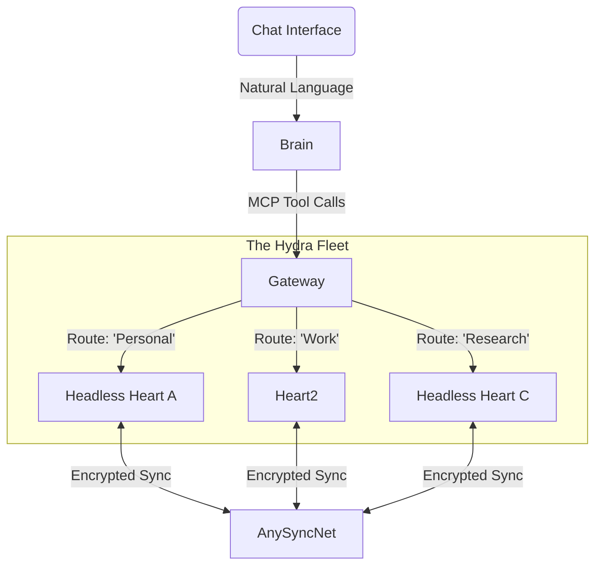

# 📑 PRD: PENNY Knowledge Core (AnyType Module)

| **Project** | **PENNY** (Personalized Enterprise Neural Network Yield) |
| --- | --- |
| **Module** | **Knowledge Core & Long-Term Memory** |
| **Version** | **2.0 (Enterprise Fleet Edition)** |
| **Status** | 🟢 **Approved for Execution** |
| **Owner** | Lead Architect (You) |
| **Objective** | To engineer a **"God-Mode" Headless Concierge** that serves as the central nervous system for PENNY, enabling autonomous architecture, management, and population of AnyType Spaces across multiple cryptographic identities. |

---

## 1. 🦅 Executive Summary & Strategic Fit

The **PENNY Knowledge Core** is not merely a database connector; it is the **Persistent Memory** and **Ontological Architect** for the entire PENNY initiative. While other PENNY agents (browsers, coders, emailers) are transient, the Knowledge Core ensures that their output is structurally captured, encrypted, and organized within **AnyType**.

This module implements a **"Hydra" Architecture**: a centralized orchestration brain managing a dynamic fleet of headless AnyType nodes. This allows PENNY to simultaneously operate as "Personal You," "Business You," and "Anonymous Researcher You" without cross-contamination of cryptographic keys.

**Core Value Proposition:**

1. **Sovereign Memory:** PENNY forgets nothing, but *you* own the data (Local-First).
2. **Context Switching:** Seamlessly routing data to the correct "Space" and "Identity" based on semantic intent.
3. **Autonomous Gardening:** The agent doesn't just write data; it maintains the *structure* (Ontology), cleaning up messy relations and optimizing layouts without human intervention.

---

## 2. 🏗️ System Architecture: The "Hydra" Fleet

To achieve multi-mnemonic support (handling multiple separate AnyType accounts simultaneously), we cannot rely on a single application instance. We must orchestrate a containerized fleet.

### 2.1 The Infrastructure Layer (Docker Swarm / Compose)

The system runs as a cluster of services behind a unified API Gateway.

* **`penny-gateway` (The Router):** A high-performance Python/FastAPI router. It holds the map of `SessionID -> ContainerURL`. It receives natural language or MCP requests and routes them to the correct "Identity Container."
* **`identity-containers` (The Heads):** Distinct Docker containers, each running a headless instance of **AnyType Heart** (the core logic engine).
* `container-01`: Loaded with **Personal Mnemonic**. Syncs "Life" & "Journal" spaces.
* `container-02`: Loaded with **Work Mnemonic**. Syncs "Engineering" & "HR" spaces.
* `container-03`: Loaded with **Burner Mnemonic**. Used for high-risk web scraping/research.

* **`penny-brain` (The Orchestrator):** Runs the **LangGraph** agentic loops. It decides *which* tool to call and constructs the complex JSON payloads for schema creation.

### 2.2 The Network Topology 🕸️

---

## 3. 🧠 "God-Mode" Functional Requirements

"God-Mode" is defined as the ability to perform *any* action available in the GUI via API, plus superhuman capabilities (bulk operations, schema synthesis).

### 3.1 📐 Capability: The Ontological Architect

*The Agent doesn't just fill tables; it builds them.*

* **FR-01: Schema Manifest Injection:** The Agent can accept a JSON/YAML "Manifest" defining a complete workspace structure (e.g., "Agency CRM") and execute the 50+ API calls required to build it in seconds.
* *Payload:* Definitions for Types (Client, Project), Relations (Status, Rate), and Option Selects (Active, Pending).

* **FR-02: Relation Deduplication:** Before creating a relation named "Status," the Agent *must* scan the global space dictionary. If "Status" exists, it reuses the UUID. If not, it creates it. This prevents "Schema Pollution."
* **FR-03: Layout Designer:** The Agent can programmatically set the "Layout" of an Object Type (e.g., "Set the 'Client' type to use the 'Profile' layout with 'Email' shown in the header").

### 3.2 🧪 Capability: The Research Scientist

*The Agent acts as an autonomous data gatherer.*

* **FR-04: Web-to-Graph Pipeline:**
* *Input:* "Research the top 5 Open Source LLMs."
* *Action:* Agent browses the web (Tavily/Serper), extracts data, and formats it.
* *Output:* Creates 5 "Software" Objects in AnyType, populated with Relations: `License: MIT`, `Params: 70B`, `URL:...`.

* **FR-05: PDF/Binary Ingestion:** The Agent can receive a file stream (PDF), upload it to the AnyType File Node, retrieve the Hash, and embed it into a new Object summary.

### 3.3 👁️ Capability: The Space Gardener

*The Agent manages the views and organization.*

* **FR-06: Set & View Creation:** The Agent can programmatically create "Sets" (Smart Queries).
* *Example:* "Create a dashboard showing all 'Tasks' where 'Status' is 'Pending' sorted by 'Due Date'."

* **FR-07: Bulk Refactoring:** "Find all notes tagged 'Meeting' and change their Type to 'Meeting Report'." The Agent iterates through the graph, changing Object Types and re-mapping relations.

---

## 4. 🔌 The Interface: Model Context Protocol (MCP)

The Knowledge Core exposes a standardized **MCP Server** to the rest of PENNY. This is the "API Surface" available to the LLM.

### 4.1 Primitive Tools (Low Level)

* `create_space(name: str)`
* `create_object(space_id: str, type_id: str, fields: json)`
* `search_global(query: str)`
* `get_graph_stats()`

### 4.2 Composite Tools (High Level / Agentic)

These tools encapsulate complex logic within the Python backend to reduce LLM hallucination and context usage.

| Tool Name | Description | Logic Flow |
| --- | --- | --- |
| **`ensure_ontology`** | **Critical.** Ensures a set of Types and Relations exists. | 1. Fetch existing definitions. 

 2. Diff against request. 

 3. Create missing Relations. 

 4. Create missing Types linked to Relations. |
| **`smart_ingest`** | Ingests raw text/urls and structures them. | 1. LLM extracts entities. 

 2. Matches entities to existing Types. 

 3. Creates objects & links them. |
| **`daily_briefing`** | Generates a markdown summary of recent changes. | 1. Query objects modified in last 24h. 

 2. Filter by "Human Editable" types. 

 3. Summarize content. |
| **`context_switch`** | Switches the active routing session. | Updates the internal pointer to the correct Docker container (Personal vs Work). |

---

## 5. 🛠️ Implementation Roadmap & Tech Stack

### Phase 1: The "Iron Man" Suit (Infrastructure) 🛡️

**Goal:** Running the "Hydra" fleet.

* **Tech:** Docker Compose, `anytype-jsonapi-docker`, Python `httpx`.
* **Deliverable:** A `docker-compose.yml` that spins up 2 headless nodes. A Python script that can successfully `ping` both and print their Space Lists.
* **Security:** Integrate `python-dotenv` to inject Mnemonics from an encrypted local vault (never committed to git).

### Phase 2: The MCP Bridge (Connectivity) 🌉

**Goal:** Connecting PENNY to the Fleet.

* **Tech:** Python `mcp` SDK (FastMCP), FastAPI.
* **Deliverable:** An MCP Server running on port 8000. When connected to Claude/OpenAI, the model can answer: "What spaces are in my Work account?"

### Phase 3: The Architect Logic (Intelligence) 📐

**Goal:** Implementing `ensure_ontology`.

* **Tech:** Pydantic (for schema validation), AnyType Internal API (gRPC/JSON).
* **Deliverable:** The ability to paste a JSON schema into the chat, and watch the Agent build the entire database structure in AnyType automatically.

### Phase 4: The Interface (UX) 💬

**Goal:** The "Concierge" Chat.

* **Tech:** **Chainlit**.
* **Deliverable:** A polished web chat. Features:
* File Upload (Drag & Drop PDF).
* "Active Identity" dropdown selector.
* "Reasoning Log" (Show the user: "Searching...", "Creating Schema...", "Syncing...").

---

## 6. 🚨 Critical Engineering Challenges & Mitigations

| Challenge | Risk Level | Mitigation Strategy |
| --- | --- | --- |
| **Sync Latency** | High | The Agent creates a Type, then tries to create an Object immediately. AnyType might reject this if the Type index hasn't updated. **Fix:** Implement a retry/backoff loop in the `create_object` wrapper that waits for the Type ID to be resolvable. |
| **gRPC Auth Tokens** | Medium | Headless nodes generate temporary tokens on restart. **Fix:** The Gateway must implement a "Health Check & Re-Auth" loop that automatically refreshes headers on 401 errors. |
| **Concurrent Writes** | Medium | Two agents editing the same Object cause conflicts. **Fix:** Implement a Redis-based locking mechanism for Object UUIDs during write operations. |
| **Relation Explosion** | High | AI creating "Date" vs "date" vs "DateOfBirth". **Fix:** Strict fuzzy-matching logic in the `ensure_ontology` tool to force reuse of existing Relations. |

---

## 7. 📜 Definition of Done

The project is considered complete when the following "Turing Test for Admin" is passed:

> **User:** "PENNY, switch to my Business Profile. I need a new CRM space. Please set up Types for 'Clients' and 'Invoices'. Then, search the web for 'SpaceX', create a Client object for them, and log a dummy invoice for $500."
> **PENNY:** (Switches Context -> Creates Space -> Creates Types/Relations -> Browses Web -> Creates Objects -> Links Objects).
> **Result:** The user opens the AnyType desktop app, sees the new Space, sees the SpaceX client correctly typed, and the linked Invoice. **No manual clicking required.**
