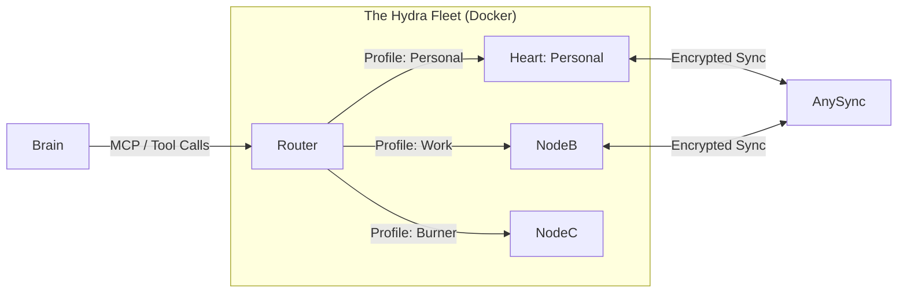

# 🪙 PENNY | Knowledge Core (AnyType Module)

> **The "God-Mode" Long-Term Memory & Ontological Architect for the PENNY Ecosystem.**

!([https://img.shields.io/badge/Status-Active_Development-green](https://www.google.com/search?q=https://img.shields.io/badge/Status-Active_Development-green))

## 📖 Introduction

The **PENNY Knowledge Core** is the persistent memory subsystem of the PENNY Agentic Initiative. While other agents browse, code, or email, this module ensures that the *intelligence* generated is structurally captured, encrypted, and organized within **AnyType**.

This is not a simple API wrapper. It is a **Headless Fleet Manager** capable of running multiple cryptographic identities (Personal, Work, Research) simultaneously. It acts as an autonomous "Gardener," architecting complex databases (Sets/Collections) and ingesting vast amounts of data without human intervention.

## 🌟 Core Capabilities

### 🔐 Multi-Tenant "Hydra" Architecture

PENNY does not log in and out. It orchestrates a fleet of isolated Docker containers, each running a headless **AnyType Heart** instance with its own mnemonic.

* **Context Switching:** Seamlessly route data to "Work" or "Personal" spaces based on semantic intent.
* **Isolation:** Cryptographic keys never leave their respective containers.

### 📐 The Architect (Schema Design)

PENNY understands Ontology. It doesn't just dump text into a page.

* **Manifest Injection:** Give PENNY a JSON manifest for a "CRM," and it will create the Object Types, Relations, and Layouts automatically.
* **Relation Deduplication:** Smart-checks existing global relations to prevent schema pollution (e.g., reusing "Status" instead of creating "Status 2").

### 🧪 The Researcher (Data Ingestion)

* **Web-to-Graph:** Scrape web content and map it to structured Objects (e.g., `Type: Article`, `Relation: Author`, `Relation: URL`).
* **Smart Linking:** Automatically links new objects to existing entities in your graph (e.g., linking a "Meeting Note" to an existing "Project").

---

## 🏗️ Technical Architecture

The system exposes a standardized **Model Context Protocol (MCP)** endpoint that the PENNY Brain connects to. Behind the scenes, it manages a swarm of AnyType nodes.



---

## 🚀 Getting Started

### Prerequisites

* **Docker & Docker Compose** (Essential for the fleet)
* **Python 3.11+** (For the MCP Server/Router)
* **AnyType Account Recovery Phrases** (The 12-word mnemonics for the accounts you want to automate)

### 1. Clone & Configure

```bash
git clone https://github.com/penny-initiative/knowledge-core.git
cd knowledge-core
cp.env.example.env

```

### 2. Define Your Fleet (`docker-compose.yml`)

We use `anytype-jsonapi-docker` to wrap the internal gRPC calls. Define a service for each identity you want PENNY to control.

> ⚠️ **SECURITY WARNING:** Never commit your Mnemonics to Git. Use the `.env` file.

```yaml
services:
  # 🧠 The Bridge: Connects PENNY to the Fleet
  mcp-server:
    build:.
    ports:
      - "8000:8000"
    environment:
      - FLEET_CONFIG={"personal": "http://heart-personal:31009", "work": "http://heart-work:31009"}

  # 🫀 Identity 1: Personal
  heart-personal:
    image: ghcr.io/ebandev/anytype-jsonapi-docker:latest
    restart: always
    environment:
      - MNEMONIC=${PERSONAL_MNEMONIC}
      - JSONAPI_ADDR=0.0.0.0:31009
    volumes:
      -./data/personal:/data

  # 🫀 Identity 2: Work
  heart-work:
    image: ghcr.io/ebandev/anytype-jsonapi-docker:latest
    restart: always
    environment:
      - MNEMONIC=${WORK_MNEMONIC}
      - JSONAPI_ADDR=0.0.0.0:31009
    volumes:
      -./data/work:/data

```

### 3. Ignition

```bash
docker-compose up -d

```

*Wait approx. 60 seconds for the headless nodes to perform their initial handshake and sync with the AnyType network.*

---

## 🔌 Integration with PENNY Brain

This module exposes an **MCP Server** on port `8000`. You can connect it to any MCP-compliant client (Claude Desktop, LangChain, etc.).

**MCP Configuration:**

```json
{
  "mcpServers": {
    "penny-knowledge": {
      "command": "python",
      "args": ["-m", "mcp_client_cli"],
      "url": "http://localhost:8000/sse"
    }
  }
}

```

---

## 🛠️ Available Tools (MCP)

These are the "God Mode" tools exposed to the LLM.

| Tool Name | Arguments | Description |
| --- | --- | --- |
| `switch_profile` | `profile_name` | Switches active routing context (e.g., "personal" -> "work"). |
| `ensure_schema` | `json_manifest` | **The Architect.** Takes a full definition of Types/Relations and creates them if they don't exist. |
| `create_object` | `type_id`, `fields` | Creates a new object with specific Relation values. |
| `smart_ingest` | `text`, `source` | Uses LLM to parse raw text and structure it into the current space's ontology. |
| `search_graph` | `query`, `type_filter` | Semantic search across the knowledge graph. |

### Example Prompt for PENNY

> "PENNY, switch to my **Work** profile. I need to track a new project. Please ensure we have a 'Project' type with 'Status' and 'Due Date' relations. Then, create a project object named 'Alpha Protocol' and set the status to 'Planning'."

---

## 🧩 Schema Manifest Format

To architect spaces programmatically, PENNY accepts a standardized JSON manifest:

```json
{
  "space_target": "CRM",
  "ensure_types":}
      ]
    }
  ]
}

```

---

## ⚠️ Known Limitations & Gotchas

1. **Sync Latency:** Creating a Type and immediately creating an Object of that Type can fail if the local index hasn't updated. The MCP server handles retries, but allow for ~2s latency on schema changes.
2. **Concurrent Writes:** Avoid editing the *exact same block* on your desktop app and through PENNY simultaneously. CRDTs handle most conflicts, but "Last Write Wins" applies to Relation values.
3. **Resource Usage:** Each Headless Heart consumes ~200MB RAM. A fleet of 5 identities will require ~1GB+ RAM.

## 🤝 Contributing

We welcome pull requests! Please see `CONTRIBUTING.md` for details on how to add new "Composite Tools" to the Python bridge.

## 📜 License

This module is licensed under **MIT**. The underlying `anytype-heart` is subject to Any Association's license.
